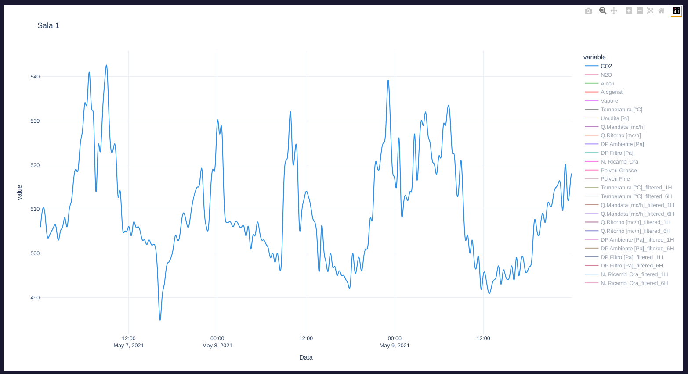

# Data Preprocessing steps

This script preprocesses a dataset containing sensor data from Sala 1, encompassing gas, climate, and dust measurements collected over three days. The primary goal is to prepare the data for subsequent analysis and visualization by addressing common data quality issues.

## Data Loading and Merging

The script begins by loading data from individual Excel files for each sensor type and day. These dataframes are then merged into a single comprehensive dataframe, ensuring that all measurements are aligned in time. This step involves careful consideration of potential discrepancies in timestamps between the different sensor readings.

## Data Cleaning and Transformation

Several data cleaning steps are performed to ensure data consistency and accuracy:

* **Timestamp Standardization:** Timestamps are standardized to remove millisecond precision for better alignment and to avoid potential numerical instability in subsequent analysis.
* **Missing Value Handling:** Missing values, which can arise from various sources like sensor malfunctions or data transmission errors, are meticulously handled. Initially, polynomial interpolation of order 3 is employed to estimate missing values based on the surrounding data points. This method leverages the inherent smoothness often observed in sensor data. Subsequently, forward and backward filling are applied to address any remaining gaps, ensuring that the time series remains continuous.
* **Data Resampling:** To ensure uniform temporal resolution, the data is resampled to a 30-second interval. This step facilitates consistent analysis and comparison across different time periods.

## Final Result

The preprocessed dataset, now in a clean and consistent format, provides a solid foundation for further analysis. The uniform time resolution and the careful handling of missing values enhance the reliability of subsequent analyses, such as identifying trends, detecting anomalies, or building predictive models. The resulting dataset can be readily used for visualization, enabling a clear and insightful understanding of the sensor data collected in Sala 1.

 
